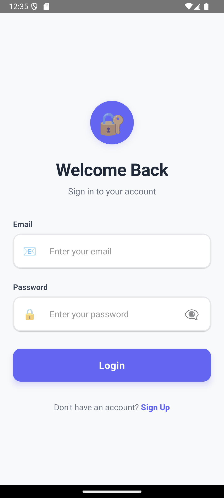
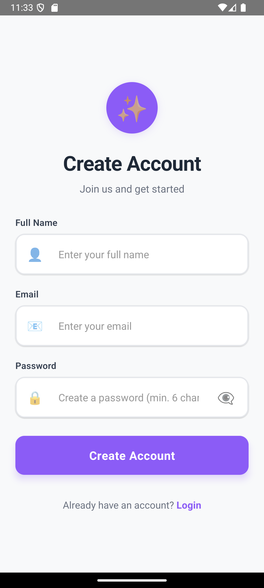
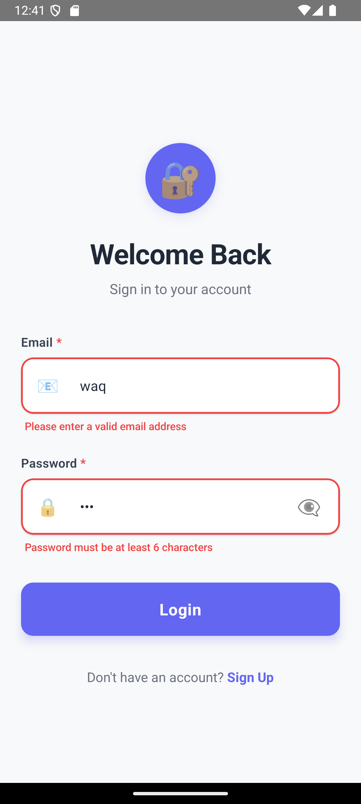
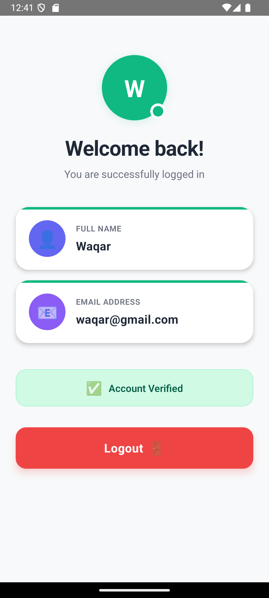

# React Native Authentication App

A professional React Native application built with TypeScript that implements user authentication with Login, Signup, and Home screens. The app uses React Context API for state management, AsyncStorage for persistence, and React Navigation for seamless navigation.

## Features

### Core Features

- ✅ **User Authentication**: Complete login and signup functionality
- ✅ **Context API State Management**: Global authentication state using React Context
- ✅ **Form Validation**: Comprehensive validation for email, password, and required fields
- ✅ **Error Handling**: User-friendly error messages for all validation scenarios
- ✅ **Persistent Authentication**: Uses AsyncStorage to maintain login state across app restarts
- ✅ **Navigation**: Smooth navigation between Login, Signup, and Home screens
- ✅ **TypeScript**: Fully typed codebase for better development experience

### Bonus Features

- ✅ **Password Visibility Toggle**: Eye icon to show/hide password in both Login and Signup screens
- ✅ **Professional UI Design**: Modern, clean, and intuitive user interface
- ✅ **Loading States**: Activity indicators during async operations
- ✅ **Keyboard Handling**: KeyboardAvoidingView for better mobile experience
- ✅ **Error Boundary**: React Error Boundary for graceful error handling
- ✅ **Type Safety**: Complete TypeScript implementation with strict mode
- ✅ **Testing Setup**: Jest configuration for unit testing

## Screenshots

> 📱 **For a comprehensive visual demonstration with detailed feature walkthrough, see [DEMONSTRATION.md](./DEMONSTRATION.md)**

### Login Screen



- Email and password input fields
- Password visibility toggle
- Form validation with error messages
- Navigation to Signup screen

### Signup Screen



- Name, email, and password input fields
- Password visibility toggle
- Comprehensive form validation
- Navigation back to Login screen

### Validation Screens



- Real-time form validation
- Error messages displayed for invalid inputs
- User-friendly validation feedback



### Home Screen

- Displays logged-in user's name and email
- Logout functionality with confirmation dialog
- Clean card-based layout

## Tech Stack

- **React Native**: 0.72.6
- **TypeScript**: 5.2.2
- **React Navigation**: 6.x (Native Stack Navigator)
- **AsyncStorage**: For persistent storage
- **React Context API**: For global state management

## Prerequisites

Before running this project, make sure you have the following installed:

- **Node.js** (>= 18)
- **npm** or **yarn**
- **React Native CLI**: `npm install -g react-native-cli`
- **Android Studio** (for Android development)
  - Android SDK
  - Android SDK Platform
  - Android Virtual Device (AVD)
- **Xcode** (for iOS development, macOS only)
  - Xcode Command Line Tools: `xcode-select --install`
  - CocoaPods: `sudo gem install cocoapods`

## Installation

> **Important**: This repository contains the source code for a React Native app. To run it, you need to initialize a React Native project first to generate the native Android/iOS folders. See [SETUP.md](./SETUP.md) for detailed instructions.

### Quick Setup

1. **Initialize React Native Project**

   ```bash
   npx react-native@0.72.6 init AuthApp --version 0.72.6
   cd AuthApp
   ```

2. **Copy Project Files**
   - Copy the `src/` folder from this repository
   - Copy `App.tsx`, `index.js`, `app.json`
   - Merge `package.json` dependencies
   - Copy all config files: `tsconfig.json`, `babel.config.js`, `metro.config.js`, `.eslintrc.js`, `.prettierrc.js`, `jest.config.js`, `jest.setup.js`

3. **Install Dependencies**

   ```bash
   npm install
   # or
   yarn install
   ```

4. **Install iOS Pods** (macOS only, for iOS development)

   ```bash
   cd ios && pod install && cd ..
   ```

5. **Run the App**

   ```bash
   # Android
   npm run android

   # iOS (macOS only)
   npm run ios
   ```

For detailed setup instructions, troubleshooting, and environment configuration, see [SETUP.md](./SETUP.md).

## Running the App

### Prerequisites Check

**For Android:**

- Ensure Android Studio is installed
- Create an Android Virtual Device (AVD) or connect a physical device
- Enable USB debugging on physical device
- Check: `adb devices` should list your device

**For iOS (macOS only):**

- Ensure Xcode is installed and configured
- Open Xcode and accept license agreements
- Install iOS Simulator from Xcode

### Start Metro Bundler

First, start the Metro bundler in a separate terminal:

```bash
npm start
# or
yarn start
```

### Run on Android

```bash
npm run android
# or
yarn android
```

**Troubleshooting Android:**

- If build fails, try: `npm run clean:android`
- Ensure `ANDROID_HOME` environment variable is set
- Check that Java JDK is installed (JDK 11 or 17)

### Run on iOS

```bash
npm run ios
# or
yarn ios
```

**Troubleshooting iOS:**

- If build fails, try: `cd ios && pod install && cd ..`
- Ensure CocoaPods is installed: `pod --version`
- Open `ios/AuthApp.xcworkspace` (not .xcodeproj) in Xcode if needed

## Project Structure

```
task/
├── src/
│   ├── context/
│   │   └── AuthContext.tsx      # Authentication context and provider
│   ├── screens/
│   │   ├── LoginScreen.tsx      # Login screen component
│   │   ├── SignupScreen.tsx     # Signup screen component
│   │   └── HomeScreen.tsx       # Home screen component
│   └── types/
│       ├── auth.ts              # Authentication type definitions
│       └── navigation.ts        # Navigation type definitions
├── App.tsx                       # Main app component with navigation
├── index.js                      # App entry point
├── package.json                  # Dependencies and scripts
├── tsconfig.json                 # TypeScript configuration
└── README.md                     # This file
```

## Implementation Details

### Authentication Context (`AuthContext.tsx`)

The `AuthContext` provides:

- `user`: Current logged-in user information
- `login(email, password)`: Authenticates user and stores session
- `signup(name, email, password)`: Creates new user account
- `logout()`: Clears authentication state
- `isLoading`: Loading state for async operations

**Key Features:**

- Automatic persistence using AsyncStorage
- User data validation
- Error handling for all operations
- Type-safe implementation with TypeScript

### Form Validation

**Login Screen:**

- Email format validation
- Password length validation (minimum 6 characters)
- Empty field validation
- Credential verification

**Signup Screen:**

- Name field validation
- Email format validation
- Password length validation (minimum 6 characters)
- Duplicate email check
- Empty field validation

### Navigation Flow

1. **Unauthenticated State**: Shows Login and Signup screens
2. **Authenticated State**: Shows Home screen only
3. **Navigation**: Seamless transitions between screens based on auth state

### Data Persistence

- User authentication state is persisted using AsyncStorage
- App automatically restores user session on app restart
- User data is stored securely (passwords are not stored in auth state)

## Code Quality

- ✅ Full TypeScript implementation with strict mode
- ✅ Consistent code formatting (Prettier)
- ✅ ESLint configuration for code quality
- ✅ Error handling throughout with Error Boundary
- ✅ Loading states for better UX
- ✅ Accessible UI components
- ✅ Clean component structure
- ✅ Jest testing setup
- ✅ Type-safe navigation with React Navigation

## Testing the App

1. **Signup Flow:**
   - Navigate to Signup screen
   - Fill in name, email, and password
   - Submit form
   - Should navigate to Home screen

2. **Login Flow:**
   - Navigate to Login screen
   - Enter registered email and password
   - Submit form
   - Should navigate to Home screen

3. **Persistence Test:**
   - Login to the app
   - Close the app completely
   - Reopen the app
   - Should remain logged in

4. **Logout Flow:**
   - From Home screen, click Logout
   - Confirm logout
   - Should navigate back to Login screen

## Development Scripts

```bash
# Start Metro bundler
npm start

# Run on Android
npm run android

# Run on iOS
npm run ios

# Run tests
npm test

# Run tests in watch mode
npm run test:watch

# Generate test coverage
npm run test:coverage

# Lint code
npm run lint

# Fix linting issues
npm run lint:fix

# Type checking
npm run type-check

# Clean build artifacts
npm run clean
```

## Future Enhancements

Potential improvements for production:

- Integration with backend API (REST/GraphQL)
- JWT token management with refresh tokens
- Biometric authentication (Face ID, Touch ID, Fingerprint)
- Password reset functionality
- Email verification
- Social login (Google, Facebook, Apple)
- Enhanced security measures (encryption, secure storage)
- Unit and integration tests
- CI/CD pipeline setup
- Performance monitoring
- Analytics integration

## License

This project is created as an assessment task for Kloudius, demonstrating React Native authentication implementation.

## Author

**Waqar Hussain**

This project was created as an assessment task for Kloudius, showcasing React Native, TypeScript, and authentication implementation skills.
